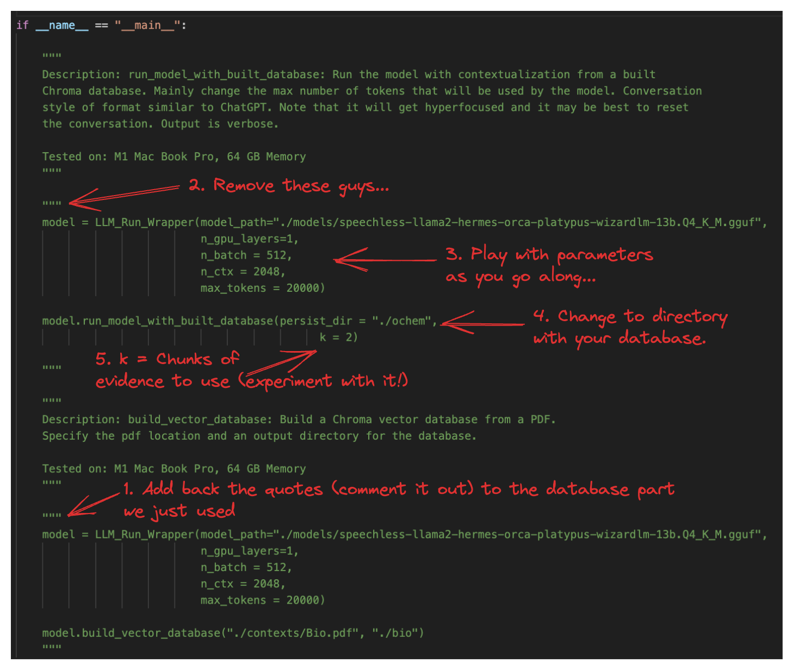

# Local LLM Textbook Support

## Summary
Obtaining help while learning should not be limited to asking questions to real people. This is especially problematic for individuals who are self-studying topics and would like to ask questions... but unfortunately do not have people to ask questions to. Thus, I present Local LLM Textbook Support, a brief tutorial and framework to essentially incorporate your textbook to fuel respoonses from a large language model (LLM). The project is best suited for most concept based classes as quantitative reasoning isn't does not produce the most parsable textbooks. However, it may be worth a try! Realistically, setting up this project will take 1-3 hours depending upon the user's past experience. Furthermore, additional textbooks will take 5-10 minutes to add. Note that this was built on an M1 Mac. Thus, installation procedures will be for an M1 mac. Extensive documentation does exist for installing on other platforms, however.

## Graphical Representation


## Notes on Installing

0. `git clone llm_textbook_support`
1. Work through the setup.sh file, excuting each.
2. Install llama-ccp-python with the following command (for M1 Mac)

`CFLAGS='-arch=arm64' CMAKE_ARGS="-DLLAMA_METAL=on" FORCE_CMAKE=1 pip install llama-cpp-python --no-cache-dir`

3. Start by creating a vector database with your PDF.

Here, I'll do it with the "Method_Conversation_Context_Summary" file. Please make sure your model is installed...

Set the parameters...


Then run in the terminal...

```
cd llm_textbook_support \\ or whatever directory is called
python OOP_Method_Conversation_Context_Summary.py \\ run
```

4. This will take awhile...
5. Now we can run inference!



6. Now we can run the script again and it will bring up the chatting function!

```
cd llm_textbook_support \\ or whatever directory is called
python OOP_Method_Conversation_Context_Summary.py \\ run
```

7. You'll be chatting in the terminal... Sorry! No fancy GUI yet.

## Contact

Questions? 

Email me: knakats@emory.edu

Ken Nakatsu '25

Emory University, Emory College of Arts and Sciences

B.S. Applied Mathematics and Statistics
